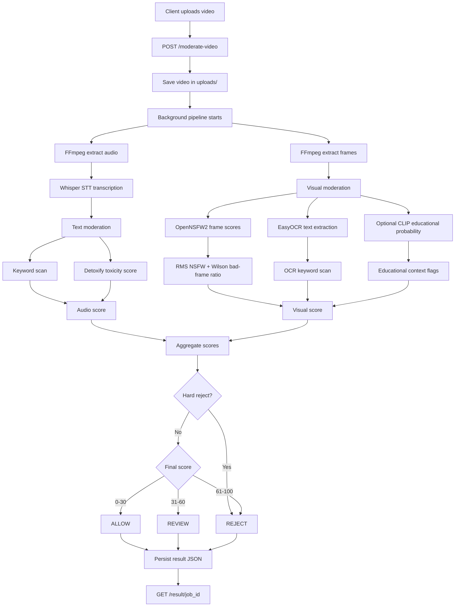

# Educational Video Moderator

Automated moderation pipeline for uploaded educational videos.



If your Markdown preview does not render Mermaid, use this plain workflow:

```text
Client upload
    |
    v
POST /moderate-video
    |
    v
Save video -> start background pipeline
    |
    +--> Audio branch:
    |       FFmpeg audio -> Whisper STT -> keyword scan + Detoxify -> audio_score
    |
    +--> Visual branch:
            FFmpeg frames -> OpenNSFW2 + OCR + optional CLIP -> visual_score + flags

audio_score + visual_score
    |
    v
aggregate()
    |
    +--> hard reject? -> REJECT
    |
    +--> final score 0-30  -> ALLOW
    +--> final score 31-60 -> REVIEW
    +--> final score 61+   -> REJECT
    |
    v
Persist result JSON -> GET /result/job_id
```

## Stack

| Layer | Library |
| --- | --- |
| API | FastAPI + Uvicorn |
| Audio/frame extraction | FFmpeg |
| Speech-to-text | faster-whisper |
| Text toxicity | Detoxify |
| NSFW frame scoring | OpenNSFW2 |
| OCR | EasyOCR |
| Educational scene context | CLIP, optional |

## Run

```powershell
cd C:\functionality_testing_module\testing_envrionment\video_moderator
uvicorn app.main:app --reload --host 127.0.0.1 --port 8000
```

## API

### `POST /moderate-video`

Starts moderation in the background.

```bash
curl -X POST http://127.0.0.1:8000/moderate-video -F "file=@lecture.mp4"
```

### `GET /result/{job_id}`

Polls an async moderation job.

```bash
curl http://127.0.0.1:8000/result/abc123
```

### `POST /moderate-video/sync`

Runs the pipeline synchronously. Use only for short test videos.

## Current Response Shape

```json
{
  "status": "ALLOW",
  "final_score": 28.5,
  "audio_score": 12.0,
  "visual_score": 45.0,
  "nsfw_hard_detected": false,
  "toxicity": 0.08,
  "educational_probability": 0.74,
  "transcript": "Today we'll learn about photosynthesis ...",
  "ocr_bad_words_found": false,
  "bad_words_found": false,
  "flags": ["educational_context"],
  "hard_reject_reason": null
}
```

Old result JSON files may still contain the earlier `nsfw_detected` field. New runs use `nsfw_hard_detected`.

## Scoring Summary

Audio score:

- Detoxify toxicity is chunked for long transcripts.
- Chunk toxicity is combined with RMS, so a highly toxic chunk still affects the score.
- Keyword hits add points only when toxicity is already elevated.

Visual score:

- NSFW frame scores are aggregated with RMS and a Wilson lower-bound bad-frame ratio.
- OCR bad words add to visual score only when NSFW is already elevated.
- Educational probability adds reviewer flags, not direct score changes.

Final score:

```text
final_score = AUDIO_WEIGHT * audio_score + VISUAL_WEIGHT * visual_score
```

Decision thresholds:

| Final score | Decision |
| --- | --- |
| 0-30 | ALLOW |
| 31-60 | REVIEW |
| 61-100 | REJECT |

Hard reject overrides:

- Any frame above `_NSFW_HARD_THRESHOLD`
- Toxicity score greater than or equal to `TOXICITY_HARD_REJECT`
